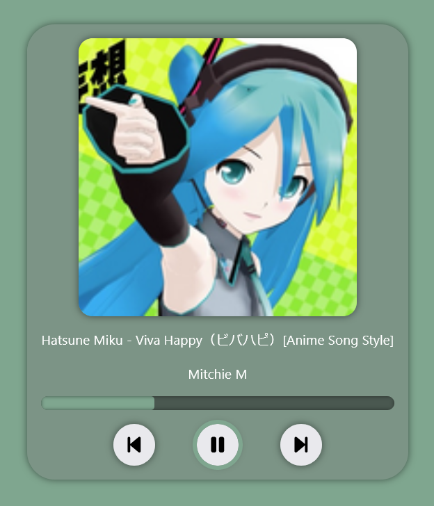

# Media Control HTTP API

Python + WinRT

## Introduction

Media Control is a HTTP API for controlling media playback.

It build on top of WinRT and supports any apps that use it.
But **only** Windows is supported (for now).

For example, it can be used for control using external devices (tablet) or for streaming.

Used [MediaSession lib](https://github.com/virashu/Media_Session).

## Features

### 1. Get playback information
   
  GET `http://127.0.0.1:8888/data`

### 2. Control playback

GET/POST `http://127.0.0.1:8888/control/<command>`

Command is one of:
  - `play`
  - `pause` (toggle)
  - `next`
  - `prev`
  - `stop`
  - `repeat` (toggle none/track/all)
  - `shuffle` (toggle on/off)
  - `seek` + `&position=<position in %>`

## Web example

Available in [www/player](./www/player/)

